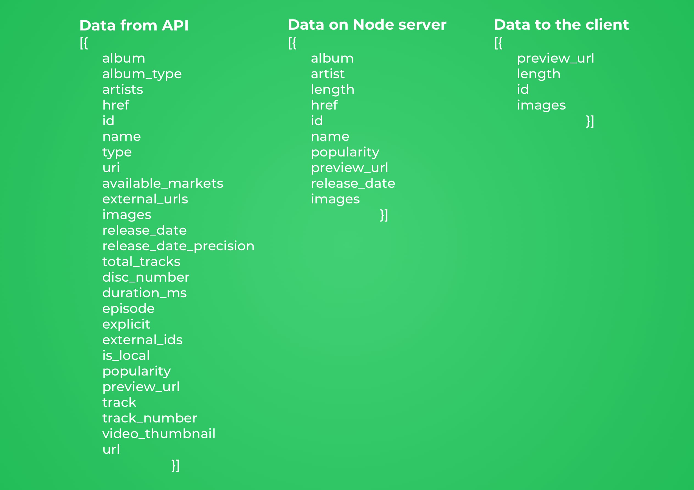
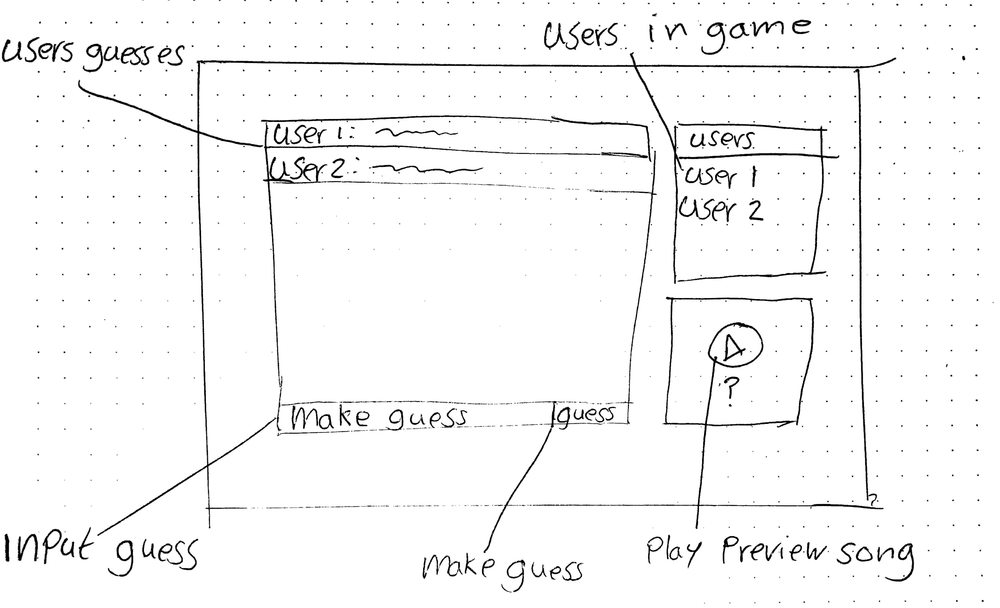
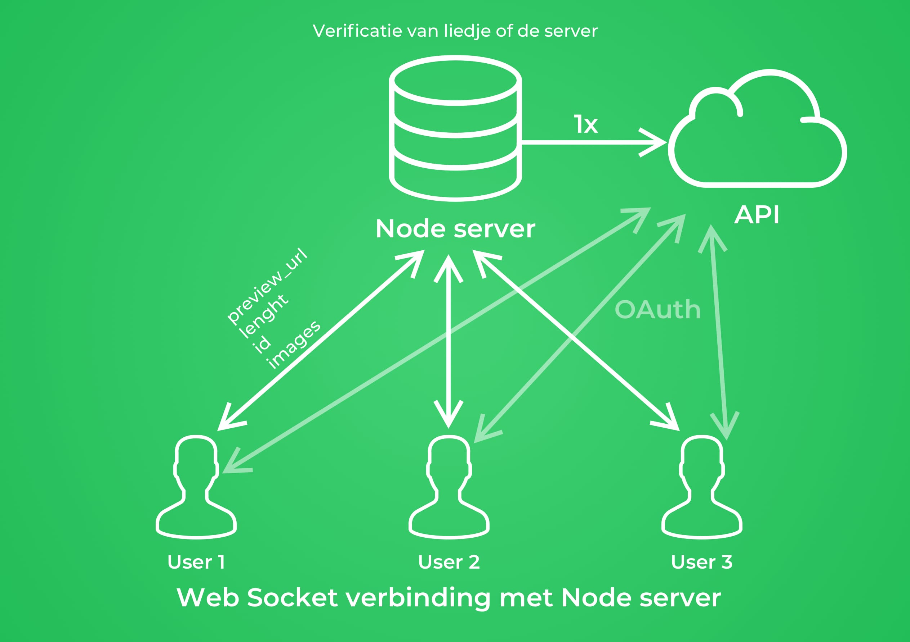

# Real Time Web
## Chat App uitbreiding
[Live link chat app](https://chat-app-tjebbe.herokuapp.com)

### Aanpassingen
1. Ik heb een functie toegevoegd die je tekst bericht omzet naar de positie van de letter van het alfabet. Dus de "a" wordt een 1, "b" wordt een 2 etc.
Als je bijvoorbeeld "appel" intikt, krijg je het volgende als resultaat: 1-16-16-5-12. Alle cijfers worden afgevangen door er blokhaken eromheen te zetten. Als je een 1 intikt, dan wordt dat [1], zodat je nog wel ziet dat het een cijfer is. En alle tekens blijven je zien.
2. Er is de mogelijkheid toevoegd dat je een eigen gebruiksnaam kan invullen voordat je kunt chatten.
3. Ik heb een broadcast toegevoegd die laat weten aan andere gebruikers als iemand aan het typen is.

### Toegevoegde waarden
Ik heb deze functies toegevoegd om te oefenen met websockets.

## Spotify guess the song
### Het concept
Ik ga een game maken waar verschillende gebruikers in een chatroom kunnen aanmelden. Deze gebruikers krijgen allemaal dezelfde willekeurig liedje uit een Spotify afspeellijst te horen. Dit liedje krijgen ze maar 5 seconden te horen en daarna moet ze raden welk liedje die was.
Ze kunnen het liedje nog een keer afspelen, maar dan krijgen ze minder punten. Ook de gebruiker die het snelste het liedje heeft geraden, krijg meer punten.

### API beschrijving
#### Spotify API
[Link naar Spotify API](https://developer.spotify.com/documentation/web-api/)

#### Voorbeeld datapunt

#### Rate limit
De rate limit wordt niet specifiek aangegeven. Elke applicatie met een 'Client ID' heeft zijn eigen rate limit. Het maakt niet uit hoeveel gebruikers er per applicatie ingelogd zijn.

#### Autorisatie
Om gebruik te maken van de Spotify API, moet je op de developers website van Spotify aangeven welke app gebruik gaat maken van de API. Als dit gedaan is, krijg je een client id en een client secret key die je mee moet geven tijdens de autorisatie. Je krijgt een access token terug waarmee je requests kan maken.
Ook moet je op de website aangegeven waar de gebruiker naartoe verwezen moet worden als de gebruiker toegestaan heeft.

### Schets met interactie

Dit is mijn hoofdscherm van de applicatie. Hiervoor zit nog een overlay scherm waar je jouw gebruikersnaam in kan vullen. De gebruikersnaam komt rechts in het lijstje bij te staan.

### Data life cycle

Mijn applicatie staat op deze manier verbonden met mijn Node server en de Spotify API. Ze moeten inloggen met de OAuth standaard om een access token te krijgen. Vervolgens staan ze in verbinding met de Node server.

### Feedback
Waar ik graag feedback op zou willen:
1. Ik twijfel nog over de datapunten afbeelding. Is het zo duidelijk voor de lezer welke data ik gebruik?
2. De diagram van hoe mijn applicatie verbonden staat met de API en de gebruikers weet ik niet goed of het zo klopt en of het duidelijk is?
3. Hoe ik in het algemeen de README heb beschreven?

Op deze punten zou ik graag feedback op willen vragen. Bedankt voor het doorkijken.