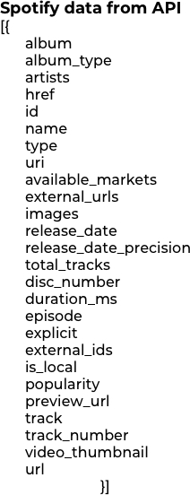
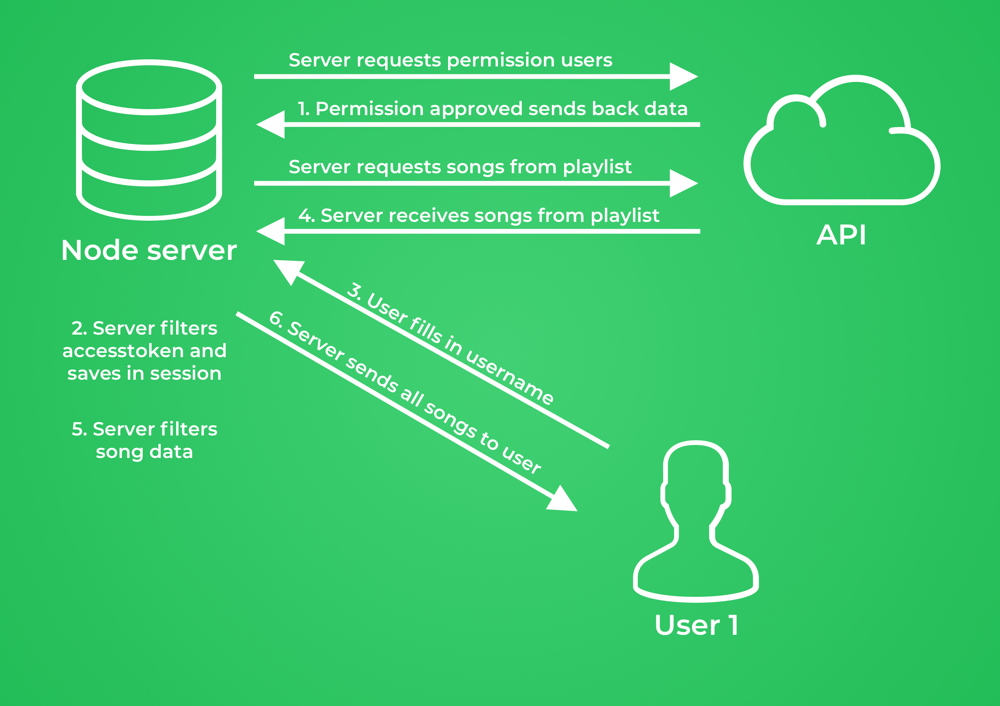
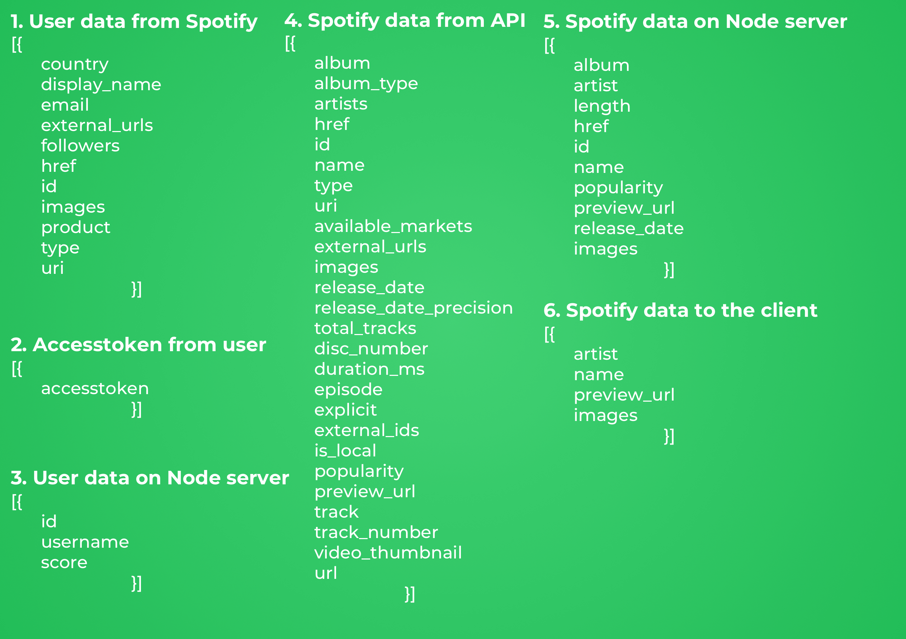
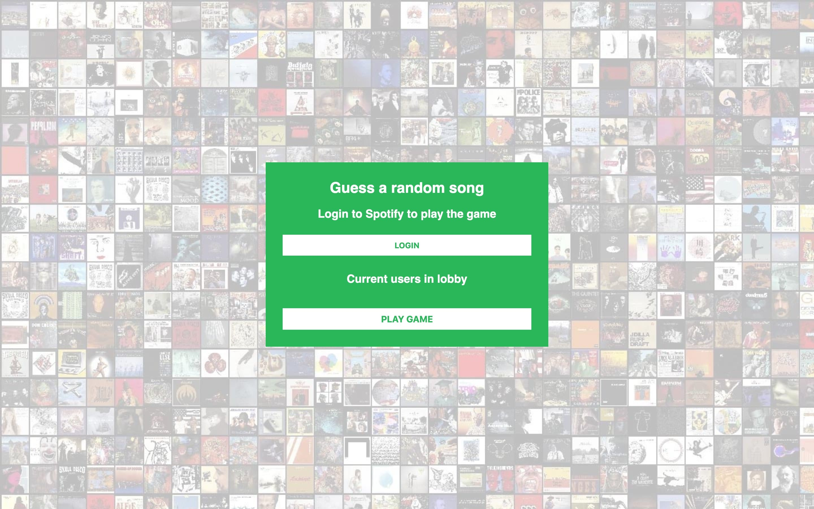
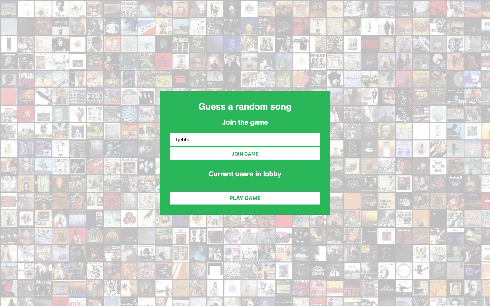
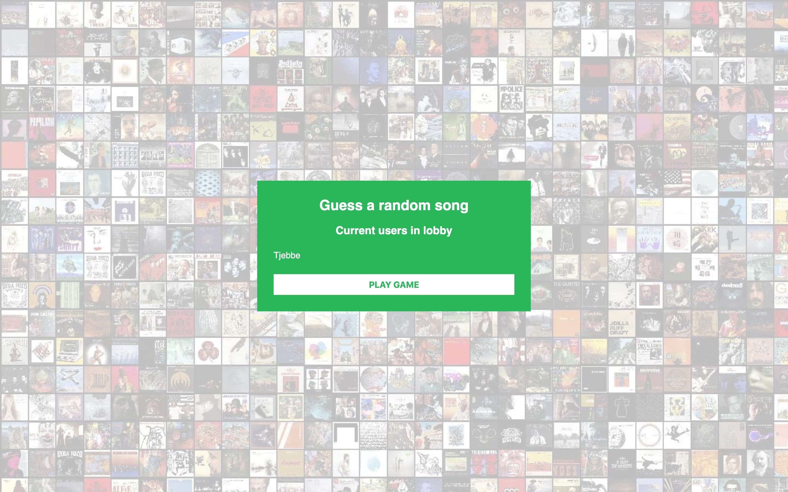
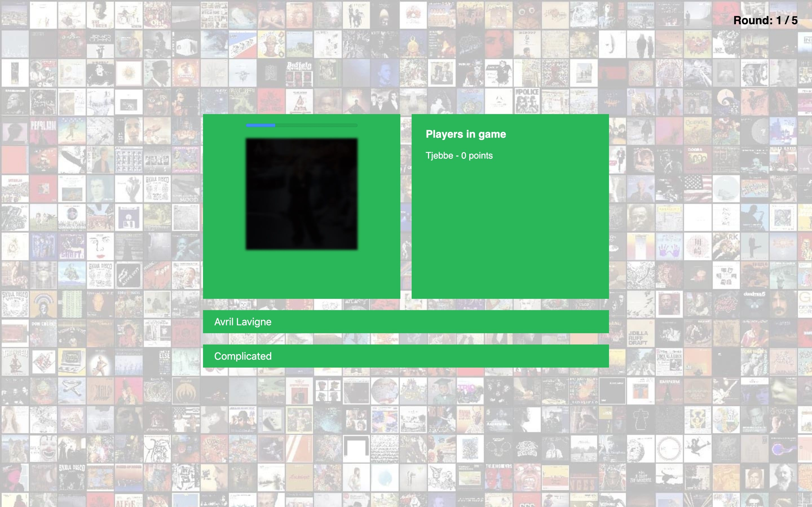
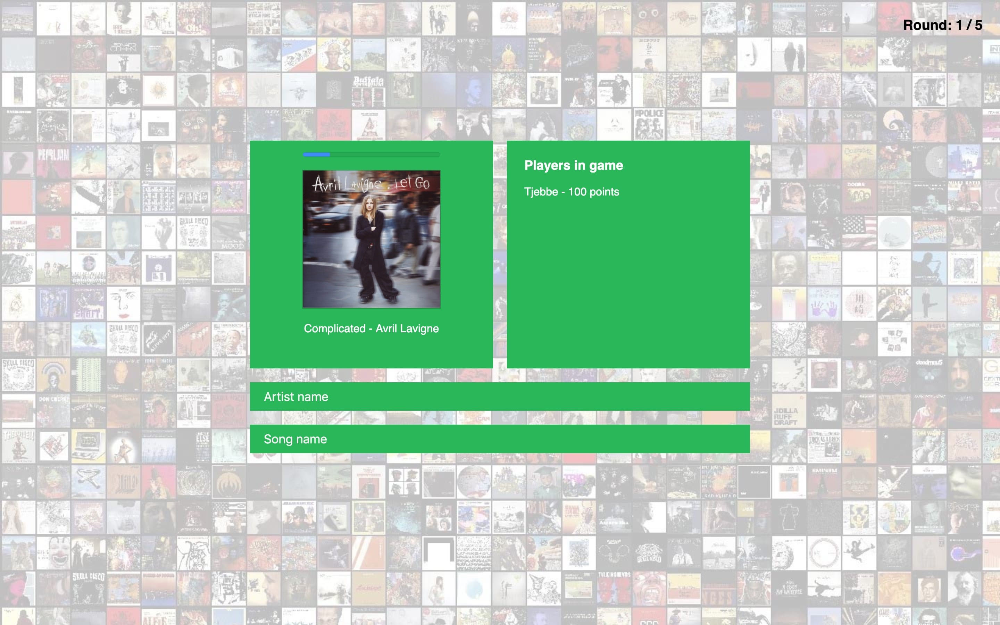
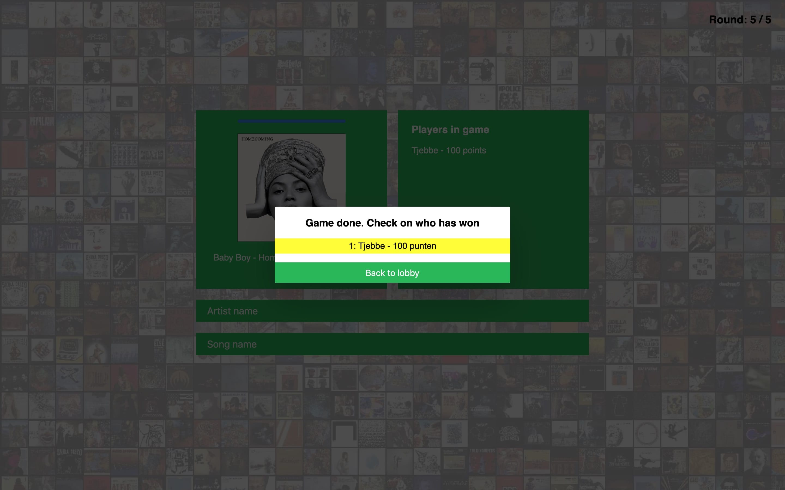

# Real Time Web
## Chat App uitbreiding
[Live link chat app](https://chat-app-tjebbe.herokuapp.com)

### Modifications
1. I added a function to convert text to the position of the letter in the alphabet. So the 'a' will be a 1, 'b' will become a 2 etc.
If you type in the word 'apple' for example, you get the following as a result: 1-16-16-12-5. All numbers will be captured and the '[]' characters will goes around the number. So if the number 1 is typed, this will become: [1]. So you still see that is a number.
2. Every user can fill in there own username.
3. A broadcast is added so the other user knows when you are typing.

### Why these modifications
I added these modifications to practice with websockets.

## Spotify guess the song
[Live link guess song game](https://spotify-guess-song.herokuapp.com/)

### The concept
I'm going to make a game where multipule users can enter a lobby and they will be asked to guess a song based on a couple of seconds from the song. These users will get the same song and user can fill in the artist and the song name. You get 50 points for each right answer, so you can get 100 points in total per round if you have both questions correct.

### The API
I going to make use of the Spotify API. You need to have a access token to able to get access to the library. You can get an access token if you give your Spotify account access to the app.
[Spotify API link](https://developer.spotify.com/documentation/web-api/)

#### Example datapoints

#### Rate limit
There is no rate limit perse. Every application has there own 'client id' and his own rate limit. It doesn't matter how many users are logged in at a time.

#### Authentication
To use the Spotify API, you have to indicate which app is going to use the API. If this is done, you get a client id and a client secret key. These keys will go along with the authentication. An access token is returned by which you can do requests to the Spotify API.

### First iteration
#### Drawing with interaction

This is the main screen for the application. Before this screen, there is a popup where can fill in your username to play the game with. Your username is filled in on right in the list.

#### Data life cycle

My application is connection with the Node server and the Spotify API. All users have to login with OAuth to get play the game. After that, there are connected with my Node server.

### Second iteration
I decided to start over with the development of the application. I had many bugs to fixed, so it was better to make a whole new server than try to fix all the bugs.
I still have the same concept and idea.

### Data Life Cycle
#### Data Life Cycle

#### OAuth authentication

#### App flow

### Interactie schets

There are 3 main screens for the game.
1. The lobby screen where players can join.
2. The game itself. Where songs are played and guesses can be made.
3. The results screen. This is a popup above the game screen. To let the players know who has won this game.

### Web screens

The final result looks like these screenshots above. The version works with multipule users and multipule different songs.

### Web socket events
I have multipule emits and on events for the socket.io library. These send data between the server and the client for real time page manipulation.

**User emits**
- .emit('user success')
Verstuurd de server als de user nog niet bestaat, zodat de username form weggehaald kan worden.

- .emit('user failed')
Verstuurd de server als de user al wel bestaat, zodat de client weet dat die een nieuwe username moet invullen.

- .emit('new user')
Verstuurd de client naar de server als er een nieuwe username binnenkomt.

- .emit('all users)
Verstuurd de server om alle usernames te renderen op de pagina.

- .emit('delete user')
Verstuurd de client als diegene uit het spel gaat.

**Game emits**
- .emit('game started')
Verstuurd de server als het spel begonnen is zodat iedereen in de lobby meekan.

- .emit('play game')
Verstuurd de client als de user op play game klikt.

- .emit('game done')
Verstuurd de server als alle rondes voorbij zijn naar iedereen.

**Song emits**
- .emit('all songs')
Verstuurd de server naar iedereen met alle liedjes zodat daarmee het spel gespeeld kan worden.

- .emit('play song')
Verstuurd de server om de client te laten weten dat het liedje afgespeeld moet worden.

- .emit('stop song')
Verstuurd de server om de client te laten weten dat het liedje gestopt moet worden.

- .emit('get results')
Verstuurd de server om alle resultaten op te halen.

**On events**
- .on('connection')
Krijgt de server binnen als er een nieuwe connectie gemaakt wordt.

- .on('new user')
Krijgt de server als er een nieuwe user binnenkomt die de server op moet slaan.

- .on('update score')
Krijgt de server binnen als de score geupdate moet worden.

- .on('game done')
Krijgt de server binnen als de game helemaal afgelopen is zodat die alles kan leegmaken.

- .on('disconnect')
Krijgt de server binnen als een user weggaat uit het spel.

### Installing

    git clone https://github.com/tjebbemarchand/real-time-web-1819.git
    cd guess-song
    npm install
    npm run

### What can be added to the app (future ideas)
- Change the number of rounds
- Better styling
- Leaderboards
- Multipule rooms
- Select from differen genres or playlists
- Invite other players
- Account system
- Store popular songs
- Animations